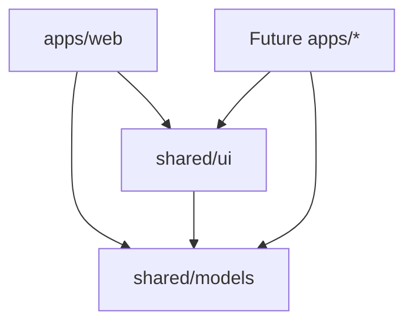

# Project Architecture

## Overview

The project follows a modular workspace architecture designed for scalability and maintainability. Built on the principle of minimizing codebase volume through increased efficiency, it organizes code into logically complete functional units with clear boundaries.

## Workspace Structure

```
app-template-dx/
├── apps/
│   └── web/                # Dioxus web application
├── shared/
│   ├── ui/                 # Reusable UI components library
│   └── models/             # Common data models and business logic
├── docs/                   # Comprehensive documentation
├── scripts/                # Development and deployment automation
├── .pre-commit-config.yaml # Automated quality assurance
├── flake.nix              # Nix development environment
└── Cargo.toml             # Workspace configuration (Rust 2024)
```

## Architecture Principles

### 1. Modularity
- Each crate is responsible for a specific functional area
- Minimal dependencies between modules
- Clearly defined public interfaces

### 2. Reusability
- Common components are extracted into shared crates
- Data models are centralized in shared/models
- UI components in shared/ui are available to all applications

### 3. Efficiency
- **Rust 2024 edition** for latest language optimizations
- **Minimal dependencies** for fast compilation and reduced complexity
- **Zero-cost abstractions** through Rust's ownership system
- **Static file generation** for optimal deployment

### 4. Template-First Design
- **Workspace-level separation** of common vs. application-specific concerns
- **Multiple application support** through apps/ directory structure
- **Reproducible setup** with Nix flakes and initialization scripts

## Crates

### apps/web
- **Purpose**: Main Dioxus web application entry point
- **Dependencies**: dioxus, shared-ui, shared-models
- **Responsibility**: Application composition, routing, main entry point
- **Location**: Application-specific logic only

### shared/ui
- **Purpose**: Reusable UI components
- **Dependencies**: dioxus, shared-models
- **Responsibility**: Base components, styling, UX patterns

### shared/models
- **Purpose**: Common data models and business logic
- **Dependencies**: serde, criterion (benchmarks)
- **Responsibility**: Data structures, serialization, validation, business rules
- **Features**: Comprehensive testing, benchmarking, integration tests

## Dependencies



## Quality Assurance

### Automated Checks
- **Pre-commit hooks** automatically installed via Nix environment
- **Code formatting** with rustfmt (stable features only)
- **Linting** with clippy (MSRV-aware configuration)
- **Testing** with comprehensive unit, integration, and benchmark tests

### Development Environment
- **Nix flakes** for reproducible development setup
- **Hot reload** development server for instant feedback
- **Automatic tooling** installation and configuration

## Design Patterns

### Composition over Inheritance
- Components are composed from simpler elements
- Avoiding deep inheritance hierarchies

### Separation of Concerns
- UI logic is separated from business logic
- Data models are independent of presentation
- Clear boundaries between layers

### Single Responsibility Principle
- Each crate has a single responsibility
- Functions and structures solve specific tasks

## Conventions

### Naming
- Crates: kebab-case (`shared-ui`, `shared-models`)
- Files and modules: snake_case
- Types and components: PascalCase
- Variables and functions: snake_case

### Code Organization
- Public interfaces in lib.rs
- Modules grouped by functionality
- Private details hidden from external API
